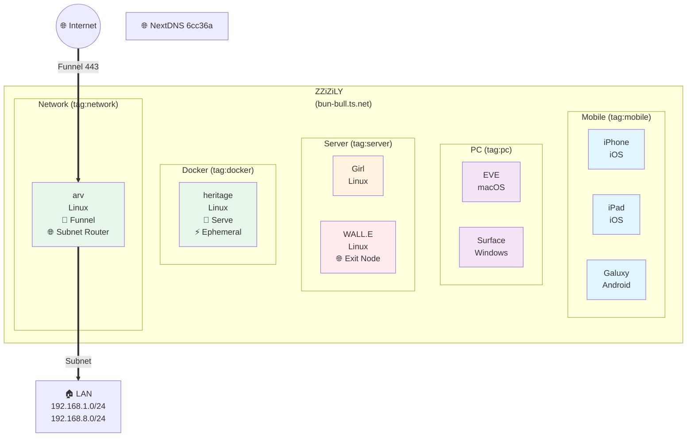
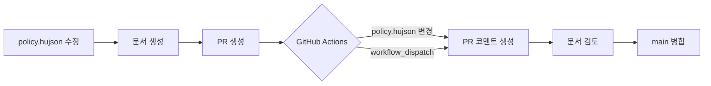

# Sylph - Network & Domain Management System

Sylph는 Tailscale ACL 정책(`policy.hujson`)을 자동으로 문서화하고 Cloudflare(DNS)를 통한 도메인을 통합 관리하는 시스템입니다.

## Sylph란?

**Sylph(실프)**는 바람의 요정을 뜻합니다. 네트워크 연결과 데이터 흐름을 상징합니다.

## 네트워크 topology



## 워크플로우



## 기능

- 📄 **Markdown 문서 생성** - ACL 정책을 사람이 읽기 쉬운 형태로 변환
- 📊 **Mermaid 다이어그램** - 네트워크 연결을 시각화
- 💬 **PR 자동 코멘트** - 변경사항을 PR에 자동으로 코멘트
- ✅ **문법 검증** - HUJSON/JSON 유효성 검사

## 사용법

### 로컬에서 문서 생성

```bash
# 기본 사용 (docs/acl.md 생성)
./scripts/generate-docs.sh

# PR 코멘트용 diff도 생성
./scripts/generate-docs.sh --pr-comment

# 상세 로그 출력
./scripts/generate-docs.sh --verbose

# 도움말
./scripts/generate-docs.sh --help
```

### GitHub Actions

PR이 생성되거나 `policy.hujson`이 변경되면 자동으로 PR에 변경사항 코멘트가 생성됩니다.

## 파일 구조

```
.
├── policy.hujson              # ACL 정책 파일
├── scripts/
│   └── generate-docs.sh       # 문서 생성 스크립트
├── docs/
│   └── acl.md                 # 생성된 문서
└── .github/workflows/
    ├── tailscale-acl.yml      # ACL 적용 워크플로우
    └── acl-docs.yml           # 문서화 워크플로우
```

## CLI 옵션

| 옵션 | 설명 | 기본값 |
|------|------|--------|
| `-p, --policy FILE` | policy.hujson 경로 | `policy.hujson` |
| `-o, --output DIR` | 출력 디렉토리 | `docs` |
| `--pr-comment` | PR 코멘트용 diff 생성 | - |
| `--compare REF` | 비교할 git 참조 | `HEAD~1` |
| `-v, --verbose` | 상세 로그 출력 | - |
| `-h, --help` | 도움말 표시 | - |

## 네트워크 진단 도구

이 프로젝트는 네트워크 문제 해결을 위해 다음 MCP 서버들을 사용합니다.

### GlobalPing

전 세계 분산 프로브를 통한 네트워크 진단 도구입니다.

- **ping** - 호스트 도달 가능성 확인
- **traceroute** - 네트워크 경로 추적
- **DNS查询** - DNS 레코드 확인
- **HTTP** - HTTP 엔드포인트 테스트

```bash
# 예: arv.bun-bull.ts.net 경로 추적
# MCP: globalping traceroute
```

### Cloudflare Radar

인터넷 트래픽 및 공격 인사이트를 제공합니다.

- **트래픽 분석** - HTTP/DNS 트렌드
- **공격 탐지** - L3/L7 DDoS 공격 현황
- **BGP 정보** - 라우팅 변경사항 및 이상 징후
- **인터넷 품질** - 속도 및 품질 메트릭

```bash
# 예: ASN 정보 조회
# MCP: cloudflare-radar get_as_details
```

## 요구사항

- `jq` - JSON 처리
- `python3` + `json5` - HUJSON 파싱

```bash
# Ubuntu/Debian
sudo apt install jq python3-pip
pip install json5

# macOS
brew install jq python3
pip3 install json5
```

## 문서 형식

생성되는 문서는 다음 섹션들을 포함합니다:

- 📋 개요
- 👥 그룹 및 사용자
- 🏷️ 태그 및 소유자
- 🔐 ACL 규칙
- 🔑 SSH 규칙
- 📊 네트워크 연결 다이어그램 (Mermaid)
- 🔗 참고 링크

## 라이선스

MIT
